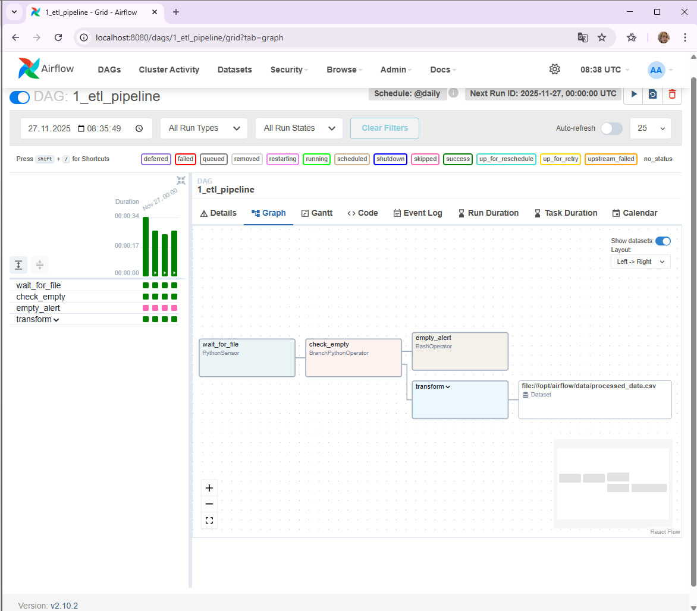
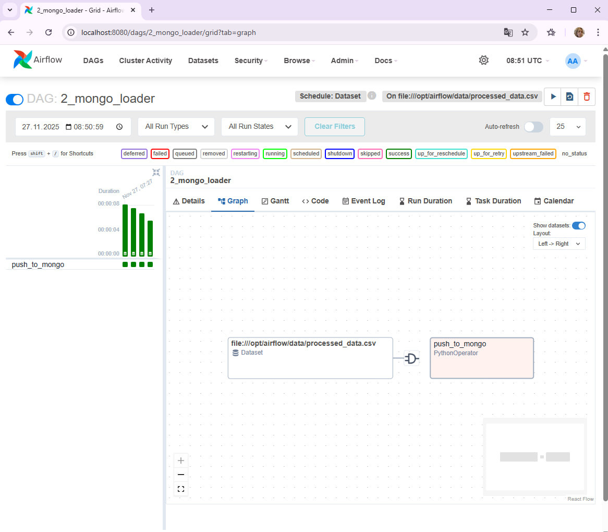
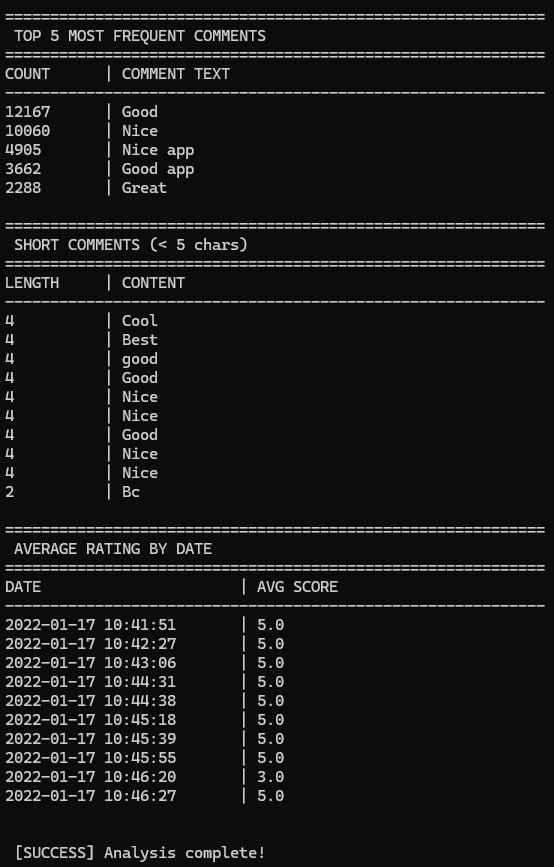

# Airflow ETL Pipeline with MongoDB

## Project Description
This project implements a complete ETL pipeline using **Apache Airflow**, **Docker**, and **MongoDB**.
It processes CSV data, cleans it using Pandas, and loads it into a MongoDB database using Data-aware scheduling.

## Features
* **Dockerized Environment:** Airflow and MongoDB run in isolated containers.
* **ETL Logic:**
  * Detects file presence (PythonSensor).
  * Checks if file is empty (Branching).
  * Cleans text data (removes emojis, special chars) and handles missing values.
  * Sorts data by date.
* **Orchestration:** Uses TaskGroups for organization and Dataset Scheduling to trigger the loading DAG automatically.
* **Analytics:** Includes a Python script to generate insights from MongoDB.

## Project Structure
* `dags/1_etl_pipeline.py`: Main DAG for data processing.
* `dags/2_mongo_loader.py`: Loader DAG triggered by dataset updates.
* `dags/modules/`: Python modules with separated business logic (Best Practices).
* `dags/get_analytics.py`: Script to run aggregation queries.

## Visuals

### 1. ETL Pipeline DAG (Graph View)
This DAG handles file sensing, checking, and data transformation.


### 2. Mongo Loader DAG
This DAG is triggered automatically when the dataset is updated.


### 3. Analytical Results (Terminal Output)
Results of the aggregation queries running against MongoDB data.


## How to Run
1. **Start Infrastructure:**
   ```bash
   docker-compose up -d --build
   ```
2. **Configure Connection:**
   Go to Airflow UI -> **Admin** -> **Connections** and add a new connection:
   * **Conn Id:** `mongo_default`
   * **Conn Type:** `MongoDB`
   * **Host:** `mongo`
   * **Port:** `27017`

3. **Trigger Pipeline:**
   Unpause both DAGs and trigger the **`1_etl_pipeline`** DAG.

4. **Check Results:**
   Run the analytics script inside the container:
   ```bash
   docker-compose exec airflow-scheduler python /opt/airflow/dags/get_analytics.py
   ```